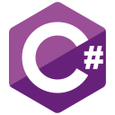
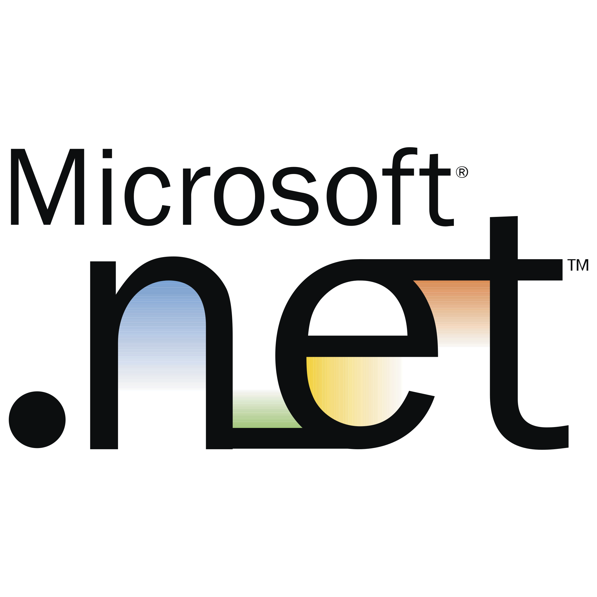
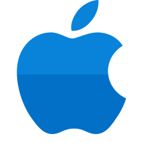
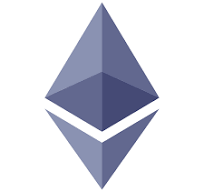
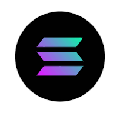
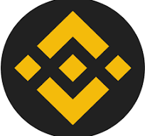

# About me - Full Stack Blockchain Developer #

*-* Skiled in working with **web technologies** like **React.js**, **Nodejs**, **Mongodb**, **MySQL**, **Nextjs**, **Nuxtjs**,**ASP.NET**, **ASP.NET Core Web API** **Springboot**, **TypeScript**, **Firebase**

*-* Solid experience with *iOS* frameworks such as **SwiftUI**, Core Data, Core Animation, **UIKit**, **SpriteKit**, **GameplayKit**

*-* Proficient in **web3js** and **smart contract** building using **solidity**, **Rust**, **Go** on **Etherium**, **Solana**, **BNB** Chains.

*-* Proficient in **VIPER** and **MVVM**, **BloC**, **MVC**, design pattern, **Clean Architecture**

*-* Experience in **CI/CD pipeline** setting and management using **Xcode Cloud**, **Codemagic**, **gitlab**

*-* Experience in Call streaming integration using **Agora SDK**.

*-* Experience working with Push Notifications with **APN** and **Firebase**

*-* Experience in charge of iOS app Store deployments, iOS Provisioning and Distribution profiles, Certificates and App IDs, as well as Test Flight Beta version distribution.

*-* Skilled in Dart language including **web3dart** library, **Flutter** framework, Flutter **Clean Architecture**.

*-* Skilled in **Riverpod**, **Provider** and **Hook** for **State** management in flutter.

*-* Experience in working with Google Maps API, GPS Location Data, Google Play Services API, Google Analytics, Google Cloud Messaging API, Location Manager, and Notification Manager.

*-* Hands on experience on **React Native**.

*-* Experience with Application Lifecycle Management (ALM) tools like Asana, Trello.

*-* Experience working with **Git**, **Plastic SCM** VCS including GitHub, GitLab, Plastic Server, Plastic Cloud

*-* **Positive** Attitude, **good** team player

*-* **Proactive self-learner** who adapts to new technologies

<!---
groupofstars/groupofstars is a ✨ special ✨ repository because its `README.md` (this file) appears on your GitHub profile.
You can click the Preview link to take a look at your changes.
--->
